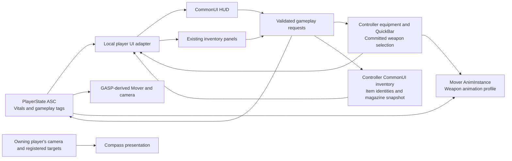

# CHALK HUD implementation plan

**Status: Phase 1 authorized and implemented on 2026-09-08; build and asset readback passed, user gameplay acceptance pending. Phases 2–6 remain later work.** See C:/UnrealEngine/Games/AZ/docs/design-briefs/hud-phase1-status.md for the current implementation and manual checks.

September 9 priority update: the magazine icon is now implemented. The user requested quick-select planning next; the focused current plan is C:/UnrealEngine/Games/AZ/docs/design-briefs/quick-select-implementation-plan.md. Weapon quick select now precedes compass in the requested order. This is a plan, not authorization to implement every later RPG phase below.

**User review correction:** the HUD was accepted visually, but hiding inventory placeholders changed the inventory's appearance. Skills, extra vitals and currency display were restored, keeping live health. This supersedes the placeholder-hiding recommendations below: preserve existing inventory presentation during HUD/data work and discuss unfinished gameplay bindings separately.

Implement the approved A + compass design on the existing CommonUI/inventory/GAS foundation. Add one local-player presentation adapter, promote the existing CommonUI HUD base, adapt the useful vendor widgets, and make inventory and HUD display the same authoritative data. Preserve the current firearm/ammo/hit-feedback work. Quick-use and missing RPG systems are explicit later gameplay phases, not fabricated widget bindings.

Approved master: C:/UnrealEngine/Games/AZ/UI Design/CHALK_HUD_v03/CHALK_HUD_v03_NATIVE.xcf. Design handoff: C:/UnrealEngine/Games/AZ/docs/design-briefs/hud-design-next-session.md.

## 1. Verified current state

Read-only source, live widget trees/CDOs, Blueprint graphs/pins and input mappings were inspected on September 8. Existing uncommitted firearm, inventory, equipment and HUD changes were preserved. Yesterday's handoff is a starting reference; today's source already contains a functional ammo/hit-feedback readout that must survive the migration.

### Actual game and HUD entry

Current editor world **/Game/AZ/Maps/L_001** overrides its GameMode with **/Game/AZ/Blueprints/Game/MHC/BP_AZ_GameMode_MHC**. That resolves the MHC Mover pawn, BP_AZ_PlayerController and BP_AZ_PlayerState. The pawn uses AZ_ABP_MoverHero_MHC / UAZ_MoverAnimInstance. Inspecting only the non-MHC GameMode would identify the wrong default pawn.

AAZ_PlayerController creates **/Game/AZ/Blueprints/Menu/HUD/WBP_AZ_Inventory**, whose native parent is **UAZ_InventoryHudWidget : UUserWidget**, still under InventoryOld. The current native class renders physical-magazine ammo and confirmed-hit feedback and binds CommonUI inventory/equipment events. It is active code despite its folder name.

**UAZ_Inv_CommonUI_InventoryHudWidget : UCommonUserWidget** already exists but is a small unused HUD base with pickup/no-room events. Promote it rather than introducing another equivalent root widget class. AHUD remains the normal engine HUD; no ProHUD GameMode HUD replacement is needed.

Sources:

- C:/UnrealEngine/Games/AZ/Source/AZ/Private/Player/AZ_PlayerController.cpp:317 — HUD creation; :347 — inventory gameplay-input capture.
- C:/UnrealEngine/Games/AZ/Source/AZ/Private/InventoryOld/Widgets/HUD/AZ_InventoryHudWidget.cpp:39 — subscriptions; :63 — ammo snapshot/hit source; :95 — temporary NativePaint presentation.
- C:/UnrealEngine/Games/AZ/Source/AZ/Public/InventoryUI/Widgets/HUD/AZ_Inv_CommonUI_InventoryHudWidget.h — existing CommonUI root base.

### Inventory widgets to preserve and reuse

All paths in this table are existing assets, not proposed names.

| Role | Asset and current use |
|---|---|
| Main screen | /Game/AZ/Blueprints/Menu/CommonInventory/AZ_WBP_GameInventoryMenu — UAZ_Inv_CommonUI_GameInventoryMenu / UCommonActivatableWidget |
| Vitals/portrait | /Game/AZ/Blueprints/Menu/CommonInventory/AZ_WBPCharacterVitalsPanel — UAZ_Inv_CommonUI_CharacterVitalsPanel; static portrait and three HQUI circular bars |
| Inventory categories | /Game/AZ/Blueprints/Menu/CommonInventory/AZ_WBP_GameInventorySwitcher — UAZ_Inv_CommonUI_InventorySwitcherPanel; real Equippables, Consumables, Craftables grids and description dock |
| Skills | /Game/AZ/Blueprints/Menu/CommonInventory/AZ_WBP_CharacterSkillsPanel — UAZ_Inv_CommonUI_CharacterSkillsPanel; four skill rows |
| Grid container | /Game/AZ/Blueprints/Menu/CommonInventory/CommonUI/UI/Widgets/WBP_AZ_Inv_GridContainer_Horror — shared by all three categories |
| Grid slot / item | Same folder: WBP_AZ_Inv_GridSlot / WBP_CommonUI_SlottedItem |
| Drag preview / context popup | Same folder: WBP_AZ_CommonUI_HoverItem / WBP_AZ_CommonUI_ItemPopUp — existing Split, Drop, Consume, Equip controls |
| Item details | Same folder + /ItemDescription/WBP_AZ_CommonUI_ItemDescription — real manifest and physical-magazine descriptions |

The main tree is MainCanvas → MenuSwitcher → InventoryCanvas → horizontal vitals / inventory switcher / skills layout. Keep this composition and its working grids, popup cancellation, item identities and description logic.

The equipped-slot classes/assets exist but **are not placed in the active inventory screen**. The standalone slot has no EquipmentTypeTag or EquippedSlottedItemClass assigned. CharacterDisplay code also exists but the active portrait is an image, not a live MetaHuman/GASP preview. Neither feature should be treated as already wired or made a prerequisite for the HUD.

### Existing presentation gaps

- Inventory Health/Infection/Mortality bars are authored at **50%**, with no native/BP attribute subscriptions. They are not actual legacy-health readings.
- Skill bars are authored at **25%**. Optional value text widgets are absent; upgrade availability, derived bonuses and **100000 CAD** are sample text. The Map button and Craftables grid do not constitute a map/recipe system.
- Active PlayerState constructs Vitals and Weapon sets. The legacy HeroAttributeSet declares primary attributes, but the Mover initialization path does not create that set. Do not assume those primary values are live just because their C++ fields exist.
- Consumable fragment types exist, but current HealthPotion/ManaPotion modifiers only print debug messages. Inventory removes an item before calling them. Exposing this path as a working medkit would be incorrect.

Detailed evidence/readbacks:

- C:/UnrealEngine/Games/AZ/Saved/HUDPlanning/inventory-audit.md
- C:/UnrealEngine/Games/AZ/Saved/HUDPlanning/inventory-tree.json
- C:/UnrealEngine/Games/AZ/Saved/HUDPlanning/inventory-defaults.json
- C:/UnrealEngine/Games/AZ/Saved/HUDPlanning/state-audit.md
- C:/UnrealEngine/Games/AZ/Saved/HUDPlanning/packs-audit.md

## 2. How GASP, GAS and attributes connect

GASP-derived Mover/animation handles movement and presentation. GAS owns gameplay attributes/actions/tags; equipment owns the selected weapon and grants. The HUD observes those owners and sends requests through existing game APIs. It does not set AnimBP variables, maintain another ammunition store, or infer gameplay state from an animation frame.

| Display | Source / event | Required behavior |
|---|---|---|
| HUD and inventory health | PS ASC → UAZ_VitalsAttributeSet Health/MaxHealth; GAS value-change delegates | Bind before initial snapshot; initialize immediately; both views agree. Never use PS.GetAttributeSet() cast to legacy Hero health. |
| Weapon/icon/name | Equipment.GetActiveItem/GetActiveWeapon/GetActiveProfile + item manifest; OnEquipmentChanged | Active state follows equipment commit/OnRep. Navigation candidate is a separate temporary highlight. |
| Inserted rounds/capacity | Inventory.GetWeaponAmmoSnapshot(active item ID); OnInventoryChanged and equipment changes | Preserve Loaded, Empty, NoMagazine and Unavailable. Unavailable is not zero. User-approved circular-magazine design hides the spare count and magazine icon; individual magazine rounds remain visible in inventory. |
| Aim/actions/interruptions | ASC gameplay-tag changes: aiming, shooting, melee, grabbed, staggered | Drive visibility/eligibility; gameplay ability/equipment remains authoritative. Preserve confirmed-hit event feedback. |
| Zero health | Vitals health ≤ 0; also observe death tags where present | Close/suppress new action UI appropriately; never manufacture a death tag. Full hero death/respawn is not implemented by this HUD. |
| XP/level/points | AAZ_PlayerState accessors and change delegates | Bind supported inventory text to actual values; no permanent XP panel in A. |
| Primary skills / other RPG meters | A live supported AttributeSet and defined values/ranges, when present | Explicit availability; no default 25/50% or invented maxima. Primary-attribute initialization and infection/stamina/mortality mechanics require a separate gameplay decision. |
| Compass bearing | Owning controller's camera manager/view yaw | Follow the camera during free look, aim and turn-in-place; not capsule, mesh or animation-root yaw. |
| Target location/distance | Registered Actor/SceneComponent + owning player's location | Weak references, explicit removal; priority/discovery comes from CHALK's target provider. Not a GAS numeric attribute. |

Useful source seams: C:/UnrealEngine/Games/AZ/Source/AZ/Private/Player/AZ_PlayerState.cpp:14; C:/UnrealEngine/Games/AZ/Source/AZ/Private/Character/AZ_PawnMoverHeroCharacter.cpp:563; C:/UnrealEngine/Games/AZ/Source/AZ/Private/Animation/AZ_MoverAnimInstance.cpp:256; C:/UnrealEngine/Games/AZ/Source/AZ/Private/InventoryUI/AZ_Inv_CommonUI_InventoryComponent.cpp:79.

## 3. Proposed implementation structure

### Shared presentation binding

Add **UAZ_PlayerUIComponent** on the PlayerController as a local presentation adapter, under Source/AZ/Public/UI and Private/UI. It holds subscriptions and read-only view snapshots, not replicated gameplay truth. Reuse FAZ_WeaponAmmoSnapshot unchanged. It feeds both the HUD and existing inventory vitals/progression panels.

Bind PS ASC when PlayerState arrives/replaces, independently of avatar readiness. Native PS sets already exist at construction. Refresh from controller BeginPlay and OnRep_PlayerState; observe possession separately for camera/action readiness. Keep inventory/equipment subscriptions across pawn changes. Unbind old ASC/tag/weapon handles on replacement and EndPlay. Tolerate late item subobjects, empty selection and destroyed targets.

Create **WBP_AZ_GameHUD** under /Game/AZ/Blueprints/Menu/HUD, based on the promoted **UAZ_Inv_CommonUI_InventoryHudWidget**. Compose independent designer-editable vitals, weapon, compass, interaction, notification and hit-feedback components. Keep the HUD passive; only the quick selector is activatable/focusable. The current HUD remains available during staging; switch the controller default once the replacement has feature parity, then disable the temporary NativePaint display to avoid duplication. Do not delete unrelated old inventory systems.

Native code owns binding, data interpretation and requests. Blueprint owns widget layout, style, animations and small vendor-interface calls. No widget property binding that polls all stats every frame. Local compass projection can update at visual cadence. Use editor-assigned widget classes, icons, style data and effects; no hardcoded /Game paths in C++.

### Reuse HQUI through its actual API

HQUI ProgressBarLinear is a **Blueprint UserWidget**, not UProgressBar. Wrap/configure it in **WBP_AZ_HUDVitals** and use its PB_SetPercent/PB_SetFillColor interface from a small BP presentation event receiving native vitals data. Use the existing circular renderer for inventory health with the same source snapshot. Do not copy HQUI's large graph into C++ or call BP-generated interfaces through brittle reflection.

Stock HQUI percentages are samples and its current interpolation is one second. Set the first valid health value immediately; use a short reviewed transition for later changes. Match A's bar, heart and critical label. Export only required icon/mask artwork from the GIMP master; keep UMG text, bars, borders, markers and groups separate. Generated scene imagery is a mockup background, not part of the in-game HUD.

### Reuse the compass without the demo dependency chain

Duplicate **WB_Compass_H** and **WB_CompassMarker_H** into AZ as **WBP_AZ_HUDCompass** and **WBP_AZ_HUDCompassMarker**. Reuse suitable material/masks/pointer art. Replace inherited/deferred initialization and style-library lookups with explicit initialization from CHALK style + owning controller. Use an editor-assigned marker class and pass OwningPlayer when creating every marker.

Stock code uses global GetAllWidgetsOfClass(...)[0] for style/container discovery, PlayerController/CameraManager(0), and a BP_CardinalDirection_H actor lookup that defaults to -90 when absent. Replace these paths, including their marker helpers. No pack GameMode HUD or demo character should be installed. Source assets stay unchanged.

Resize the compass window and marker geometry together: stock content is 896×128; strip/marker windows are 768×64 with -320 horizontal strip overscan. An outer SizeBox alone is insufficient. Preserve normalized offset/orientation mapping; do not send degrees into SetCompassOffset. Provide explicit world-north orientation in configuration. Verify cardinal alignment and wraparound against real camera headings.

Add a small registered-target presentation contract: one tracked objective plus optional waypoint, weak Actor/SceneComponent references, explicit add/update/remove, deterministic priority and teardown. A quest system can supply this later; no invented world objective and no new full quest framework. World-marker arrows are a separate optional feature.

### CommonUI input integration

Inventory already uses IMC_AZ_InventoryMenu at priority **110**, with its own back/drag/popup behavior. Shared controller context is AZ_IMC_AlwaysAllowed (priority 0), while the possessed pawn context is priority 2. The inventory component currently writes cursor/input mode; the controller separately ignores movement/look and clears weapon input.

Keep that working contract during the core HUD phase. Before adding quick select, centralize UI input capture/focus transitions in the controller so inventory and quick select cannot each restore gameplay independently. Track capture reasons and only call the stacked move/look-ignore APIs on aggregate transitions. The inventory keeps ownership of its data/menu lifecycle; its open/close forwards focus/mode requests to the common capture owner. Reuse CommonUI activation/mapping/focus and preserve its nested back behavior. Do not introduce a second action router or game-mode input framework.

On capture: reset Mover movement intent, cancel active aim through equipment, release/clear outgoing GAS weapon inputs, suppress held inputs until a fresh press, and stop game actions reaching the selector. On cancel, death/zero health, grabbed state, loss of avatar, focus loss or opening inventory: close quick select without confirming/consuming. Returning to gameplay must not replay a held fire/aim/sprint action. Reuse and extend the existing PC logic rather than bypassing it.

Proposed keyboard opening action: **hold Tab**, currently unassigned in the inspected shared/pawn/inventory mappings; release confirms, Escape cancels, with a toggle/confirm alternative. Preserve I/E/0/1. Mouse/stick selection is separate from camera input; dead zone and remembered highlight prevent accidental initial selection. Bindings remain data assets/remappable.

Do not silently replace gamepad D-pad Up/Down: current shared mappings use them for PushToTalk and DiscoveryMenu. Final gamepad opening binding requires the control-layout decision. The inspected pawn mapping is currently primarily keyboard/mouse; full gamepad locomotion coverage is not claimed by this audit. This does not block the core HUD.

## 4. Phased rollout and acceptance

| Phase | Work | Done when |
|---|---|---|
| 1 — Shared data + core A | Add the local UI adapter; promote CommonUI HUD base; build styled health/weapon views; bind inventory health to the same Vitals set; preserve ammo/hit/pickup/no-room behavior; replace temporary NativePaint only at switch-over. | HUD and inventory agree after damage and item/weapon changes. No duplicated readout, placeholder health flash, stale weapon icon, or false zero during unavailable ammo. I still opens/closes the existing inventory. |
| 2 — Compass | Adapt the two vendor widgets, configure slim layout/north/camera ownership, implement registered targets and optional visibility. | N/E/S/W and wrap are correct during look/aim/turn; target alignment/distance/removal works; compass works without a ProHUD demo HUD/cardinal actor and shows no fabricated target. |
| 3 — Weapon quick select | Add an activatable selector and shared capture handling; supply slots from real QuickBar/equipment; add SlotItemIds RepNotify/change delegate. | Candidate highlight differs from committed active state; cancel changes nothing; confirming the active weapon does not accidentally holster; queued/rejected equip requests display truth; inventory and selector do not fight for input. |
| 4 — Inventory data honesty / supported RPG views | Bind real PS level/XP/points where relevant; replace sample currency/bonuses/skill/vitals data with supported fields or hidden/unavailable states; configure missing value text fields if shown. | No authored 25/50%, 100000 CAD or fake upgrade availability is presented as gameplay. Supported values update from one owner. Existing three grids, descriptions and context actions retain behavior. |
| 5 — Consumable gameplay + quick use | Define authoritative item-use contract and real authored GAS effects/abilities; share it between popup Consume and quick use; add separate care/utility assignment/selection support rather than treating consumables as equipment. | Successful use grants the effect and spends exactly one item; failed, cancelled, repeated or invalid requests grant/spend neither. Selecting alone spends nothing. Counts update from inventory. |
| 6 — Later RPG/crafting features | Design primary-attribute initialization/ranges/upgrades, real recipes/ingredients/results, optional additional vitals/status effects, and any live portrait/equipped-slot expansion. | Each displayed field has an implemented gameplay owner and a reviewed meaning. These are gameplay features, not placeholders enabled by HUD styling. |

Phases 1–3 deliver the approved functioning HUD/compass and weapon access. The care/utility branches become usable only with Phase 5's real backend; do not show illustrative medkit/sidearm/smoke counts as owned items. The minimum Phase 4 cleanup—hiding/marking unavailable unsupported sample values—belongs alongside Phase 1, so real health is not displayed next to fabricated RPG readings. Additional supported progression bindings can follow separately. This rollout is proposed, not a claim that any phase has been implemented.

## 5. Gameplay prerequisites and failure cases

- **Consume transaction:** current Server_ConsumeItem removes inventory before a void modifier that only logs. Replace it for supported consumables with validation of owned identity, count, eligibility and effect plus an explicit request-deduplication/stack transaction version contract. Existing AmmoRevision is magazine-only and must not be repurposed as a consumable revision. A GAS ability owns use timing/cancel where needed; a single authoritative commit owns the successful effect + item cost. No free effect on failed debit, no item loss on failed effect, no double-spend on repeated input. If a stack/item disappears before commit, abort cleanly. Full-health and interrupted-use policies must be explicit.
- **Healing/death reset:** Vitals currently only processes IncomingDamage in PostGameplayEffectExecute and uses bOutOfHealth to gate Event.Death. A healing/respawn path must handle clamping and intentional latch reset; simply adding direct Health will not reset that latch. Ordinary medkits should not revive unless that gameplay is expressly designed. This does not block read-only health binding.
- **Hero death scope:** the live hero startup/grant path has no complete hero death/respawn implementation. Do not rely exclusively on Character.Dead arriving at zero health. New UI requests must check canonical vitals/eligibility and close correctly. Full death/respawn gameplay is separate scope, not silently promised by the HUD.
- **Weapon ownership:** QuickBar Select(active) currently toggles unequip. Selector confirm needs a deliberate no-op for already-active selection; keep existing 0/1 toggle semantics unless explicitly changed. Requested selection can wait at committed action boundaries; only the committed equipment event changes active HUD state.
- **Replication/order:** late PlayerState or item subobject data must produce a known unavailable state and later refresh, not cached zeros. Bind before initial read, clear old handles/weak refs, and retain player health across avatar swaps.
- **Visual scale:** use anchors/safe-area-aware layout at 16:9 and ultrawide, readable scale/contrast settings, local-player screen placement and correct font/UI material color handling. The master is 1920×1080 reference geometry, not hardcoded screen pixels.
- **Feedback:** retain current confirmed-hit events, pickup eligibility and inventory-full feedback. Any new pickup toast is sourced from a committed inventory transaction, not input press or a generic OnInventoryChanged event. That generic event also fires for shots, so it cannot mean 'item picked up'.

## 6. Planned change surface

New native presentation component/types under **Source/AZ/Public/UI** and **Source/AZ/Private/UI**; promote the existing CommonUI HUD base and add small view/quick-select bases only as needed. Extend existing PC lifecycle/capture, inventory vitals/skills presentation, and QuickBar notifications. Keep gameplay ability/effect/item-use changes in their own Phase 5 files. Do not refactor GASP/Mover locomotion or motion matching to add UI.

New project-owned widget assets under **/Game/AZ/Blueprints/Menu/HUD/**: proposed WBP_AZ_GameHUD, WBP_AZ_HUDVitals, WBP_AZ_HUDWeapon, WBP_AZ_HUDCompass, WBP_AZ_HUDCompassMarker, WBP_AZ_QuickSelect and WBP_AZ_QuickSelectSlot, with shared style data and required icon/mask exports. Reuse existing inventory child assets; adapt only panels that need data. Preserve vendor source packs and original GIMP files.

## 7. Validation and next action

Before editing, reread the currently modified source and live assigned assets because firearm work is ongoing. Implement one phase at a time. Run appropriate C++ build/Blueprint compile and static/diff checks for the actual changes. Do not add automated tests unless the user requests them. Do not start PIE/editor tests: the user runs manual acceptance, then logs are read.

Manual checks should cover immediate health agreement in HUD/inventory; empty/no-mag/unavailable and shot counts; weapon swap/drop with old-hit-source cleanup; repeated I/selector open-close while holding movement/aim/fire; cancel/zero-health/grab interruption; target destroy/unregister/behind-player behavior; camera versus mesh heading during aim/free look; screen scaling; and, after consumable implementation, full-health rejection, interrupted/repeated use and exactly-one-item commit. Confirm owning-client data after any user-run multiplayer check rather than claiming it from source inspection.

Recommended next step after plan review: **Phase 1**, delivering the approved core A visuals on the real health and magazine data while updating the existing inventory health panel at the same time. Compass follows as Phase 2. No plan-review request is needed for the already-approved visual direction; remaining review is the implementation scope/order described here.
