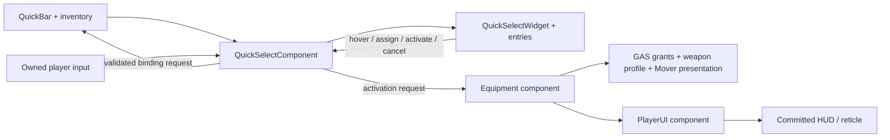

# CHALK quick select — proposed implementation plan

**Latest revision implemented:** all four physical slots are visible, empty by default and manually assignable to weapons/consumables; Fists stays intrinsic 0; mouse and number keys match; actual item names/icons use inventory composites. Current status: C:/UnrealEngine/Games/AZ/docs/design-briefs/quick-select-manual-slots-status.md. This supersedes the older two-slot/category-restricted portions of the initial plan below.

September 9, 2026. The approved first weapon-selector implementation is built and saved; user gameplay verification is pending. Current implementation and receipts: C:/UnrealEngine/Games/AZ/docs/design-briefs/quick-select-status.md. The remaining sections describe the design contract and future extensions. Weapon quick select preceded compass work, following the user's priority.

## Intended behavior

A temporary, clear cross-shaped overlay using the approved CHALK v03 palette, silhouettes and restrained panels. Updated to the user's September 9 interaction: Tab opens the bar, middle-click on a slot enters assignment, mouse wheel browses compatible owned items, another middle-click confirms the assignment. Right-click on an assigned slot activates it. Assignment and activation are separate operations. World time continues; movement, camera look and combat input are captured while choosing.

The approved implementation uses Tab toggle open/closed for this multi-step interaction. Neither Tab release nor closing the bar confirms an assignment or activates equipment. This supersedes the earlier release-to-equip proposal.

The v03 GIMP composition remains the visual reference, but its old "Release to equip" footer is superseded. Author the new widget hints as "RMB Select / MMB Assign" in browsing and "Wheel Browse / MMB Assign / Esc Cancel" during assignment.

Keep the approved directional vocabulary: left = long gun, right = sidearm, up = care, down = utility. Add a small explicit Fists entry near the center for the existing intrinsic combat profile. Fists and holstered equipment are distinct states. Directions stay stable as more content arrives; show supported entries rather than inventing the mockup's pistol/medkit/grenade ownership. Initially the functional entries are Fists and the owned rifle. A future category can contain multiple candidates without changing the direction associated with it.

Entries show the actual inventory icon/name and availability. Firearms show rounds/capacity from their own magazine snapshot, even when inactive. Unknown state shows unavailable, not zero. Fists have no ammunition. Distinguish the saved slot assignment, the temporary candidate during editing and the currently equipped item. The existing corner HUD continues to show committed equipment until the equipment owner publishes a change.

## Existing foundation, checked against source and live editor

| Owner | Present behavior | Addition needed |
|---|---|---|
| UAZ_QuickBarComponent | Authored slots, replicated physical item GUID bindings, existing BindItemToSlot request, slot selection/cycling | Slot/candidate enumeration, binding-change event/RepNotify, validated assignment acknowledgement and revision, explicit-assignment preservation, non-toggle activation |
| UAZ_Inv_CommonUI_EquipmentComponent | Validates requests, commits equipment, manages grants/weapon actor/animation profile; queues eligible requests during committed actions | Small owner-facing request result if reporting refused/deferred requests; keep selection authoritative |
| CommonUI inventory | Owned item identities, icons, counts and per-weapon magazine snapshots | Reuse read APIs and notifications; no second inventory state |
| AAZ_PlayerController | Native quick-slot inputs and inventory capture; client/server capture notification | Aggregate capture reasons for Inventory and QuickSelect, shared teardown/fresh-input handling |
| UAZ_PlayerUIComponent | Health, weapon/ammo, menu and reticle presentation | Observe selector visibility separately; suppress aim reticle/pickup prompt while keeping corner health/ammo |

Live BP_AZ_PlayerController has exactly two QuickBar definitions: slot 0 intrinsic Weapon.Fist (Punch L/R, HeavyStrike and CombatReady), slot 1 inventory-backed Weapon.Rifle accepting Item.Type.Weapon.Rifle. Number keys 0/1 use these definitions. A slot is not a general consumable shortcut.

Important existing behaviors:

- QuickBar.Select(active slot) toggles equipment off. RMB and the proposed 1–4 shortcuts must share explicit activation semantics: an already-active matching item stays equipped. Keep the legacy toggle helper for callers that deliberately need it; update the affected number-key route deliberately rather than changing Select globally.
- SlotItemIds currently has plain replication with no RepNotify/delegate. Inventory changes can auto-fill a vacant binding; equipping another compatible item can replace a binding. The highlighted candidate must retain its item GUID and be checked again at confirmation, so a changed slot cannot silently select a different object.
- BindItemToSlot already performs assignment separately from equipment activation. It validates owned backpack equipment/type and enforces one physical item per binding. Extend that seam, with server acknowledgement and expected binding revision. Manual assignments must remain stable while valid; existing auto-fill/BindSelectedItem behavior must not silently overwrite a user's choice. Removing the assigned item clears availability; do not silently substitute another item for an explicit assignment. Runtime bindings are replicated; cross-session persistence follows the project's inventory/save policy and is not yet promised by this UI plan.
- Equipment's client request return value means an RPC was sent. Its pending selection is currently private/server-only. Never turn a requested highlight into an equipped marker on that return value.
- The current CommonUI inventory is created directly with AddToViewport and ActivateWidget. There is no established native menu-layer stack to assume here.

## Separate classes and responsibilities

| Proposed class/type | Responsibility |
|---|---|
| UAZ_QuickSelectComponent, owned by PlayerController | Local Closed/Browsing/EditingAssignment session, locked edit slot, candidate GUID, wheel navigation, assignment confirm/cancel and separate activate request. Subscribes to inventory/QuickBar/equipment and lifecycle events. |
| UAZ_QuickSelectWidget : UCommonActivatableWidget | Cross layout, focus, pointer/directional input routing and open/close transitions. All text, imagery and highlights remain editable UMG elements. |
| UAZ_QuickSelectEntryWidget | Reusable icon, name, actual count/ammo, availability, candidate and equipped presentation. |
| FAZ_QuickSelectEntryView / selection key | Typed value snapshot with action kind, category, intrinsic slot or physical item GUID, display fields and state. No replicated copy of inventory or mutable weapon stats. |
| WBP_AZ_QuickSelect and WBP_AZ_QuickSelectEntry | AZ-owned designer assets under /Game/AZ/Blueprints/Menu/HUD/QuickSelect. Reuse approved artwork/fonts; configure style/assets in the editor. |

The component owns session state so widget reconstruction/focus teardown cannot accidentally submit equipment changes. The existing UI component remains the common HUD/attribute observer; the selector reads authoritative item/slot owners through its own focused presentation view. No changes to GASP animation graphs or another attribute set are needed.

## Input and lifecycle contract

### Mouse flow

| State/action | Result |
|---|---|
| Tab | Open/close the overlay (toggle recommended; optional hold-to-show uses identical explicit confirms). |
| Hover an icon/slot | Focus that slot; show a concise RMB Select / MMB Assign hint. Empty supported slots can still be populated. |
| First middle-click | Lock the hovered slot as the edit target and show its compatible owned inventory candidates. Start with the current assignment if it remains eligible. |
| Wheel while editing | Move through candidates with icon/name, actual ammo/count and an index such as 2/3. Preview only; no bind, equip or item use. Moving the pointer away does not retarget the edit. |
| Second middle-click | Submit that candidate's GUID for assignment to the locked slot. On authority acknowledgement, update the slot and return to browsing; keep the bar open. Equipment stays unchanged. |
| Right-click while browsing | Activate the hovered slot's confirmed assignment and close the overlay. It does not commit an unconfirmed candidate. Current equipment stays equipped if already active. |
| Escape while editing | Discard the draft and return to browsing with the original assignment. |
| Escape while browsing / close with Tab | Close the overlay. Any unconfirmed edit is discarded. Previously acknowledged assignments remain. |

While editing, RMB and direct slot hotkeys do not activate equipment or implicitly confirm the candidate; the player confirms with MMB or cancels first. Wheel outside assignment mode does not switch the character's equipped weapon while the overlay is open. If the category has no compatible owned items, show an empty state and disable confirmation; never manufacture an item.

### Proposed number keys

| Key | Slot/action |
|---|---|
| 1 | Long gun — preserves the current rifle shortcut's category |
| 2 | Sidearm |
| 3 | Care item |
| 4 | Utility/throwable |
| 0 | Existing Fists shortcut |

Keys 1–4 activate their assigned slot using the same request path as RMB, including while browsing the open overlay. They are remappable and shown as small key labels on entries. Reserve 2–4 until those supported definitions/gameplay exist; initially only the real rifle/Fists paths are functional. Care/utility activation readies the chosen item; actual use is a separate action and assignment never consumes an item. Gamepad opener and equivalents for assignment/cycling/activation need their own mapping pass; mouse-only gestures must not be the sole API.

Tab is unused in the audited shared, active pawn and inventory contexts. Existing conflicts must be respected: I/View opens inventory; D-pad Up is PushToTalk and Down is DiscoveryMenu; mouse wheel already switches weapons; RMB maps Aim/SecondaryAttack; LMB maps PrimaryAttack; Escape normally pauses. A scoped selector input context consumes middle-click, wheel, RMB, navigation/cancel and slot keys while active, below inventory priority 110 and above pawn priority 2. Suggested actions: IA_QuickSelectToggle, IA_QuickSelectAssign (MMB), IA_QuickSelectCycle (wheel), IA_QuickSelectActivate (RMB), and the required slot shortcuts; reuse existing Back. Pointer hover supplies the focused slot. Recheck the current bindings before implementation: another workstream has added a ChangeFireModeAction in controller source that is not reflected in the currently loaded editor yet. Its eventual binding must also be captured safely while the overlay is open.

Generalize inventory-only capture into a reason set. Apply move/look suppression only on the aggregate false-to-true / true-to-false transitions, preserving balanced ignore-input calls. Keep the existing server capture notification, aim cancellation, GAS held-input clearing and Mover movement-intent reset. Fire/aim eligibility reads aggregate capture. Opening inventory adds its capture reason and cancels the selector before removing the selector's reason, so gameplay never becomes briefly active during the handoff.

Cancel on inventory/pause takeover, lost focus, pawn change/unpossession, death/zero health, grab or another authoritative hard block. Discard unconfirmed assignments and never submit activation on teardown. Close the session and record the cancel reason BEFORE removing mappings/flushing input: DefaultInput.ini enables triggered events during input flush, and a synthetic event must never bind or activate. Closing with RMB also suppresses its held state until release, so returning to gameplay cannot start aiming or a secondary attack. Clear held aim/fire and require a fresh press on return.

MMB confirmation sends a binding request only, with candidate GUID, target slot and expected binding revision. The server rechecks ownership, compatibility, uniqueness and whether that slot changed during editing. While its acknowledgement is pending, prevent duplicate confirms; a rejection keeps the old binding. An inventory refresh prunes disappeared candidates without silently committing the next one.

RMB/number-key activation uses the confirmed bound identity and equipment gates. The committed marker/HUD changes only from OnEquipmentChanged/replicated selection. A narrowly scoped owner receipt with a request ID can distinguish rejected, deferred and completed/superseded activation requests without another gameplay selection store. Retain the existing equipment queue/cancel-window behavior; browsing and assignment never grant abilities or alter the current animation profile.

## Implementation order

1. **Slot/read/request seam.** Expose compatible owned candidates; add binding notifications/revisions, acknowledged MMB assignment and preservation of explicit choices. Add separate idempotent activation with expected item identity and rejected/deferred feedback. Keep existing authority validation and deliberately route the new 1–4 shortcuts through activation.
2. **Capture and session.** Add Closed/Browsing/EditingAssignment state and typed views; generalize capture; implement locked edit targets, draft cancellation, acknowledgement handling and held-button suppression. No per-frame inventory polling.
3. **Editable weapon selector.** Author CommonUI widget/entry and assignment candidate presentation; wire Tab, MMB, wheel, RMB and slot keys. Use live Fists/rifle content and true ammo. Add selector visibility to reticle/pickup suppression independently of inventory HUD collapse.
4. **Compile and manual acceptance.** Full C++ build/restart for new reflection, Blueprint compilation, explicit asset saves and fresh readbacks. The user runs PIE; then inspect logs and tune spacing/transition timing. Do not add automated tests without a specific request.

This first implementation includes both assignment and activation for supported weapons. Additional long guns/sidearms require actual item content and slot/category definitions. Candidate browsing uses owned items, including distinct same-type weapons by GUID; it is not limited to items already bound to QuickBar. Test with multiple real inventory instances without inventing a pistol. Assignment never equips, and activation never substitutes a different item after an inventory refresh.

## RPG, consumable and crafted-item extension

Care and utility need a supported use backend before they become functional branches. The current Red CommonUI potion is authored as Craftable/Accessory.Amulet, Blue as Consumable/Consumable.Buff, and neither contains a ConsumableFragment. The generic health/mana modifiers also only log. Craftables currently provides item storage, not recipes.

Add a real CHALK healing-item definition and authoritative GAS use transaction shared by inventory and quick use: selecting a care item only chooses it; an accepted use applies its effect and consumes exactly one item at the defined commit point. Failed/interrupted/repeated use must not produce an effect without its cost or spend without a valid effect. Add throwables through their own ability, spawn/timing and item-cost contract. A crafted medkit belongs to Care and a crafted smoke device to Utility; crafting is an origin, not a separate quick-select direction. Recipe/ingredient/result transactions remain separate work.

## Manual acceptance for the weapon slice

- First MMB enters assignment, wheel changes only the draft, second MMB changes only the binding; cancel restores the original binding. Hovering away cannot change the target slot. Empty and single-candidate lists are safe.
- RMB/1–4 activates the confirmed binding; already-active equipment does not holster. RMB/keys during assignment cannot accidentally activate the candidate; 0 retains the Fists shortcut.
- Manual bindings survive unrelated inventory/equipment updates; removing the item clears availability. Concurrent assignment/rebinding rejects stale revisions, and duplicate MMB events cannot bind twice or enter an unintended second session.
- Rifle pickup/drop/binding changes refresh availability; missing or not-yet-replicated items never appear as usable objects. A changed binding cannot confirm the wrong GUID.
- Selected versus committed markers remain correct through queued/rejected requests, supersession and possession changes. Rifle icon/reticle/ammo continue to follow committed equipment.
- Repeated open/close, inventory handoff, focus loss and cancel during held aim/fire produce no accidental shot/equip on release and leave move/look input usable.
- Health and magazine data agree with inventory; Fists show no ammo. Review 1080p/1440p, safe-zone/DPI scaling and keyboard/gamepad navigation.
- Character grants, stance/weapon animation profile and hand/back presentation still come from the existing Equipment/GAS/Mover path.

## Source anchors

- C:/UnrealEngine/Games/AZ/Source/AZ/Public/Inventory/AZ_QuickBarComponent.h and Private/Inventory/AZ_QuickBarComponent.cpp — definitions, GUID binding and toggle behavior.
- C:/UnrealEngine/Games/AZ/Source/AZ/Public/Equipment/Components/AZ_Inv_CommonUI_EquipmentComponent.h and Private/Equipment/Components/AZ_Inv_CommonUI_EquipmentComponent.cpp — committed selection, validation, pending request and grants.
- C:/UnrealEngine/Games/AZ/Source/AZ/Private/Player/AZ_PlayerController.cpp — native inputs, inventory capture and server notification.
- C:/UnrealEngine/Games/AZ/Source/AZ/Private/UI/AZ_PlayerUIComponent.cpp — HUD/reticle lifecycle and real health/weapon state.
- C:/UnrealEngine/Games/AZ/Source/AZ/Private/InventoryUI/AZ_Inv_CommonUI_InventoryComponent.cpp and Private/InventoryUI/Items/Fragments/AZ_Inv_CommonUI_ItemFragment.cpp — magazine snapshots and current consumable limitations.
- C:/UnrealEngine/Games/AZ/Config/DefaultInput.ini — input-flush event behavior.
- C:/UnrealEngine/Games/AZ/UI Design/CHALK_HUD_v03/CHALK_Quick_Select_v03_NATIVE.xcf — editable approved visual reference.
