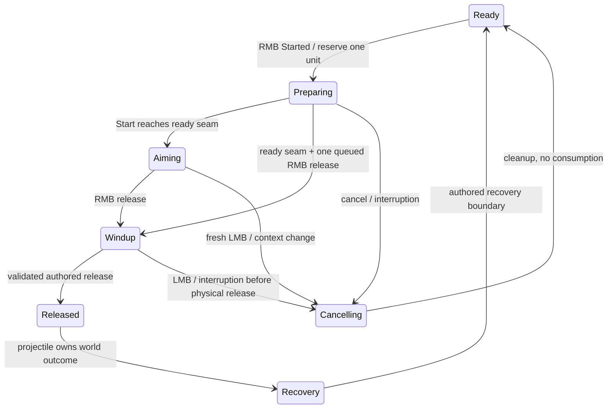

# CHALK — shared throwable system

**Original planning baseline: September 15, 2026.** Three native GIMP concepts were created first, followed by this plan. Claude has since implemented part of the system. Read the [September16 completion audit](C:/UnrealEngine/Games/AZ/docs/design-briefs/throwable-completion-audit.md) and [current completion work order](C:/UnrealEngine/Games/AZ/docs/design-briefs/claude-throwable-completion-work-order.md) before further implementation. Original execution brief: [claude-throwable-system-execution.md](C:/UnrealEngine/Games/AZ/docs/design-briefs/claude-throwable-system-execution.md).

Build one shared action for a stone, grenade, throwing knife and future throwable items. Item data chooses grip, animation family, flight and impact behavior. Inventory owns the item, GAS owns the action, Equipment owns hand presentation, Mover owns the character, and a projectile component owns the thrown world object.

September16 follow-up: read [Phase0 review](C:/UnrealEngine/Games/AZ/docs/design-briefs/throwable-phase0-review.md) together with Claude's Phase0 report. It clarifies provisional preview selection versus commit locking, response-aware collision parity and the provisional status of the reported pistol release cues. The delivered stone slice should use the retargeted unarmed family; MMB remains unchanged.

## 1. Decisions and proposed defaults

**Final user-confirmed controls, September16:** select a throwable, **hold RMB** to prepare and remain in the aiming loop with trajectory, **release RMB** to commit the throw, and **click LMB** to cancel before physical release. This supersedes both the original two-click scheme and the intermediate alternatives discussed later. Holding aims; it does not charge power or cook a grenade. Reuse the existing weapon-specific grenade families where suitable. Keep CHALK's civilian Montréal survival-horror style, its warm-white HUD, and player animation at **1×**.

**Latest September17 policy:** selecting/equipping immediately enables held idle before RMB; grenade is Equippable and carry supports normal lower-body locomotion. The subsequently submitted questions specify **standing aim/release as exclusive FullBody, crouched action as a masked upper-body mix, and Run as aim cancellation**. This supersedes the earlier movable-standing-aim recommendation. Capture/lock stance per action; count changes only at physical release. See the [numbered review response](C:/UnrealEngine/Games/AZ/docs/design-briefs/throwable-open-questions-review-response.md) and updated completion work order for movement, root-motion, cancellation and approved origin-lift handling.

Selected grenade presentation also applies in Explore: show its icon/name/actual count immediately in the primary equipment HUD row without changing the underlying mode; restore the ordinary row when selection ends. User supplied existing texture `/Game/FPS_Controller/UI/Textures/T_FragGrenadeIcon.T_FragGrenadeIcon`, already referenced by the grenade ImageFragment. Reuse that item-view asset; do not create a substitute icon. Keep the health bar in place.

**Art ownership/update, September17:** Codex creates required art; Claude integrates gameplay/runtime. The [Quiet Sage production kit](<C:/UnrealEngine/Games/AZ/UI Design/CHALK_Throw_Art_v01/README.md>) now contains native GIMP sources and11 saved Unreal art assets. Main arc/contact mesh/material references and padded canvas are already assigned in BP_AZ_GA_Throw. Preserve that work and complete runtime projection/HUD/variants against the supplied contract. Art requests/revisions stay with Codex.

**Recommended defaults in this plan, not separately confirmed gameplay decisions:**

- Cancellation disarms the pending throw and requires a fresh RMB press before preparation can begin again. Releasing a still-held RMB after LMB cancellation must do nothing. UI/menu cancellation uses the existing capture system; LMB release has no throw behavior.
- Equipped carry permits normal movement. Active standing aim uses exclusive FullBody; crouched aim retains its masked base without implicitly granting movement. Run cancels before Sprint dispatch; forced death/grab/stagger retain priority. Use the numbered review's stance-lock, cancellation and cleanup recommendations for remaining boundaries.
- RMB release during Start latches **one** throw intent for that exact action. Execute it at the earliest verified ready pose, with the Start endpoint as the safe initial seam. LMB cancellation clears that intent. No repeated throws, Held retries or cross-action input buffer.
- Use the authored Start, Loop, Close/Far and Cancel phases. Single is reserved for a possible later quick-throw path.
- Grenade fuse starts on authoritative release. No cooking, live grenade held indefinitely, or pin-pull gameplay in the first implementation.
- After recovery, keep the same ready stack when units remain and require a fresh RMB press/hold/release for another throw. When depleted, clear readiness; return to the existing committed weapon/mode. Do not silently equip another item, assign a quick slot, or force Explore/Fight changes.
- Normal grenade proposal: self-damage enabled, friendly-NPC damage follows explicit project policy (initially disabled), cover occludes damage. These are definition fields for review, not collision filters.
- First delivery shows **predicted first contact**, not final resting position or grenade blast center. Bounces may occur in gameplay without being advertised as predicted final rest.

## 2. Visual proposals

All three use the same stone example, illustrative count3/range9.4m, existing health baseline and Oswald/Roboto fonts. This isolates the arc/marker treatment rather than changing the whole HUD.

| Style | Arc | Contact marker | Assessment |
|---|---|---|---|
| 01 — Chalk & Ember | Fine warm white `#EEEAE0` | Broken peach `#FFBA8C` ring with white center/pin | Alternative; closest to existing HUD |
| 02 — Amber Thread | Warm dashed `#E8B183` | Inward notches around a thin open ellipse | More conspicuous on dark ground/foliage |
| **03 — Quiet Sage — SELECTED** | Muted `#B5C8B7` pulses | Four open corners and small white center ellipse | User-approved direction; validate bright/green scenes |

Artur selected **03 — Quiet Sage**. This supersedes the earlier recommendation of01. Keep the style data-driven; the selected reference is `C:/UnrealEngine/Games/AZ/UI Design/CHALK_Throw_v01/CHALK_Throw_03_NATIVE.xcf`.

Native sources and PNGs: [CHALK_Throw_v01](<C:/UnrealEngine/Games/AZ/UI Design/CHALK_Throw_v01/README.md>). Individual files are `CHALK_Throw_01/02/03_NATIVE.xcf`; `CHALK_Throw_Comparison_NATIVE.xcf` compares them. Every HUD label, arc, icon and marker remains an editable GIMP text/vector layer. The new generated background is a visual concept, not an Unreal asset or a verified animation pose. Its right-hand stone pose suits the generic unarmed direction; rifle/pistol grenade families use the left hand.

Rendering rules:

- Arc begins at the calibrated release origin, ends at the first collision, and remains depth-aware. Do not draw a valid continuation through a fence, wall or character.
- Contact marker uses the hit surface's point and normal. Ground gets a perspective ellipse; a wall gets a surface-aligned contact mark, not a horizontal disk floating in front of it. A body contact can use a compact impact glyph instead of projecting a large ground decal through the victim.
- Open center, restrained alpha, thin dark contrast edge, no heavy bloom or opaque colored ground disk. Color is reinforced by shape/text: an unsafe release uses a cross and **OBSTRUCTED**.
- A legitimate near-wall impact is not automatically an invalid throw. Distinguish a clear launch that soon strikes a wall from a hand embedded behind cover.
- No collision within the prediction horizon: fade/open the line end and hide the contact marker. This alone does not forbid an otherwise safe throw into open space.
- The small ring is a targeting marker, **not an area-of-effect radius**. Do not draw a grenade blast footprint at its first bounce. A future fuse/bounce solver can earn a separately labelled estimated detonation footprint.
- Show selected item name, actual remaining count and contextual controls. Preserve the existing weapon/ammo and Fight/Explore presentations outside throwable context. Runtime key hints come from bindings, not hardcoded mouse labels.

## 3. Original September15 integration baseline

| Existing mechanism | Reuse / limitation |
|---|---|
| CommonUI inventory item manifests, GUIDs, stack counts and world/backpack ownership | Canonical item state; no widget-owned quantities |
| QuickBar `ReadyItemId`, readiness event, manual binding receipts | Currently consumable-category-only; extend by throwable capability, including a unique knife |
| Equipment committed selection/generation and source-owned grants | Preserve weapon ownership; use a token-owned presentation lease for offhand throws or temporary holstering |
| Reload reservation and commit flow | Template for release-atomic inventory mutation; existing instant `Server_ConsumeItem` is unsuitable |
| Existing drop/pickup payload and GUID validation | Reuse identity/ownership rules, not the passive randomized drop-spawn function |
| GAS montage/event task and gameplay-event notify | Reuse lifecycle rail, but add validation of action, montage and release phase; generic events do not carry that identity |
| PlayerUI/QuickSelect event-driven views | Extend current adapter, preserving inventory layout and manual assignments |
| Damage GameplayEffect/execution and AI hearing | Reuse for impact/explosion consequences and stone distraction |

At that initial audit, no complete native throw ability/projectile executor was found. Those historical receipts are under `C:/UnrealEngine/Games/AZ/Saved/ThrowPlanning/`. The native action, solver, projectile and reservation path now partially exist; use the linked completion audit for current status instead of rebuilding them.

## 4. Animation: use Start, with responsive branching

The inspected rifle/pistol family is deliberately segmented. Sampled Start-end→Loop-start, Loop seam, and Loop-start→Close/Far/Cancel entry match pelvis/spine03/hands within approximately **0.017cm / 0.021°**. This is raw-pose evidence, not final visual approval of the layered MetaHuman pose.

| Phase | Pistol/Rifle duration | Intended use |
|---|---:|---|
| Start | 0.766667s | Retrieve/raise into the ready pose |
| Loop | 1.233333s | Hold while the player aims indefinitely |
| Close / Far | 1.5s each | Throw plus authored recovery |
| Cancel | 1.066667s | Put away/lower from ready pose |
| Single | 1.8s | Candidate self-contained quick throw; not required for this flow |

**Verified exact-MH family:** `/Game/AZ/Assets/Pistol/AZ_Pistol_Grenade_Throw_{Start,Loop,Close,Far,Cancel,Single}`. All non-numbered sequences are in-place, nonadditive, RateScale1, on `/Game/MetaHumans/Common/Female/Medium/NormalWeight/Body/metahuman_base_skel`. They have **no release notifies**. Numbered `1` versions enable root motion; avoid those for movable upper-body preparation.

**User's rifle family:** `/Game/RifleAnimsetPro/Animations/InPlace/Rifle_Grenade_Throw_*` exists, but the inspected files use the vendor UE4 skeleton. No exact-MH equivalent was found among156 matching assets. Verify any additional retargets the user provides before duplicating work; do not assume a source name proves MH compatibility.

**Unarmed:** `/Game/MovementAnimsetPro/Animations/InPlace/Throw_Start`, `ThrowLoop`, `ThrowEndClose`, `ThrowEndFar`, `ThrowCancel`, `ThrowSingle1/2`. Source UE4 skeleton; old `AnimPro_Throw*` retargets use SurvivalMan. A compatible-skeleton declaration alone does not validate the grip/pose on the current body. Unarmed throws are right-handed; rifle/pistol throws are left-handed.

**Knife:** `/Game/FightingAnimsetPro/Animations/InPlace/KB_KnifeThrow` is a1.716667s UE4 source candidate, with no verified exact-MH knife hold/release family. Validate/retarget appropriate content and calibrate a knife grip; do not label grenade-hand poses as knife-ready without inspection.

Recommended action sequence:

Show the preview as soon as a valid preparation request is accepted; do not make the UI wait for the whole Start. During Start, use the calibrated eventual release anchor and mark the action Preparing. Keep aim live until a queued commit actually branches into Windup. Releasing RMB in Loop branches promptly: **do not wait for a whole1.23s loop to finish**. Arbitrary loop frames still need an appropriate short pose blend; a montage section jump does not magically create a crossfade. Keep authored endpoint seams, and use the existing blending mechanism if a visible hand pop remains.

Measure hand opening/release, ready/cancel windows and recovery hand-back per clip. A new release cue must carry or be validated against the exact action/montage instance/phase. Missing cues cancel safely; watchdogs do not invent throws. Recovery is already in Close/Far; do not append another full recovery animation or fixed lock timer. Use a measured hand-back boundary if the long unarmed tail delays control.

One montage with sections is a suitable starting representation where measured seams fit; runtime section control is supported by Unreal. Separate montage assets remain acceptable if required by the project's actual pose blending. This is a recommendation for CHALK's assets, not a claim that every AAA title uses the same implementation. [Epic montage documentation](https://dev.epicgames.com/documentation/unreal-engine/animation-montage-in-unreal-engine?lang=en-US)

## 5. Character, held item and camera

On selection/equip, blend into the carried-item idle immediately without RMB, reservation or preview. Return to it after cancel/recovery while the selected stack remains; clear it on depletion/deselection. Equipped carry uses upper-body layering over live idle/walk/run/crouch and stance transitions. Under the latest policy, standing preparation/aim/release is exclusive FullBody; crouch uses its separately validated masked presentation. Capture stance and prevent mid-action route switches. A sequence assignment alone is not proof of a working carry lane.

Keep Mover and its base pose coherent beneath these presentations. The dedicated Throwable splice is after the final ordinary aim blend and before FullBody. FullBody intentionally overrides legs during standing exclusive aim, so scope movement/feet ownership correctly and restore carry cleanly. RootMotionFromEverything is active, but physical capsule drive still requires the explicit Mover bridge and valid measured deltas; do not infer it from limb footwork or apply standing RM to a crouched mask.

Introduce explicit throw pose/camera context. Do not borrow `Ability.State.Aiming`: it activates firearm aim poses, sockets and tight zoom. Live camera values include Explore220cm/FOV90 and firearm Aim30cm/FOV50; proposed throw framing stays wide, near the existing exploration/strafe range, with final values tuned by the user. Preserve look input, camera collision and terrain-height smoothing.

Equipment controls a generation/token-owned temporary hand presentation. Left-hand grenade families can retain a right-hand pistol/rifle; primary-hand items may require temporary holstering. The profile decides. Suppress weapon support-hand IK and aim/relaxed overlays on the throwing limb so they do not pull it back onto the gun. A higher-priority grab/death cleans up the throw lease. Restore presentation only if the captured equipment generation still matches.

Use per-profile hand bone/socket plus local grip transform. `Hand_LeftSocket` exists but is uncalibrated; dedicated owned ThrowGrip_L/R sockets are optional. Do not move the existing rifle/pistol sockets. For an equipped unique knife, coordinate transfer/retirement of that exact presentation rather than creating two visible knives.

## 6. One action, data-driven item behavior

Proposed types, names adjustable to current conventions:

- A throwable capability fragment references `UAZ_ThrowableDefinition`.
- Definition contains presentation family/hand/grip, held/projectile mesh, release/ready/cancel/recovery metadata, flight model, speed/pitch limits, gravity scale, world collision radius, inherited-velocity policy, first-contact preview style, impact behavior and recovery policy.
- Weapon-context animation variants live in a reusable presentation profile. While Preparing/Aiming, choose a stable provisional Close/Far candidate with hysteresis and use its calibrated release transform for the preview; names do not determine speed. Freeze that displayed candidate when Windup commits. Do not wait until RMB release to discover a different launch origin, or flap between candidates near a threshold.
- One `UAZ_GA_Throw` owns Preparing/Aiming/Windup/Recovery and its action ID. One local `UAZ_ThrowPreviewComponent` presents a derived solution. One authoritative `AAZ_ThrowableProjectile` owns flight and the item payload, with small behavior strategies/data for stone, grenade and knife.
- Extend existing readiness with a generation/revision. Selecting away and back to the same item GUID must invalidate old input/cues. Grant one shared ability through an established startup/source convention; never grant another spec per stack unit or click.

| Item | Flight/outcome | Inventory consequence |
|---|---|---|
| Stone | Ballistic bounce/settle; impact noise; optional direct-impact damage | Spend one stack unit at release; one recoverable world unit if configured |
| Grenade | Ballistic bounce; fuse begins at release; detonate once at current position even when airborne/resting | Spend one unit at release; no return after detonation |
| Knife | Ballistic direct impact; configured embed/stop or ricochet; cosmetic mesh orientation independent of collision shape | Unique GUID/state leaves inventory and returns through one recoverable payload |

Grenade/knife specifics extend the shared action, not three copied ability state machines. Gameplay numeric damage, fuse, speed and bounce values remain data tuning; do not hardcode the mockup's9.4m or3 items.

## 7. Input arbitration and cancellation

Live mappings: LMB→PrimaryAttack; **RMB→both SecondaryAttack and Aim**. Route throwable intent before existing ASC dispatch. One RMB Started edge prepares once; one corresponding RMB Released edge requests Commit once while both ordinary RMB paths are consumed. LMB cancels without also firing/punching. Respect CommonUI/menu capture and the existing post-selector mouse-release gate: the RMB used to select an item, including its later release, cannot also prepare or throw it. Outside throwable context, fire/Ready, precision aim and melee inputs remain unchanged.

ASC Pressed alone does not start an inactive ability. Preserve an explicit RMB Started activation path, following the existing Jump precedent, and exclude throw from Held retries. Keep the ability active while aiming and use `WaitInputRelease` or an equivalent single canonical release route to request the throw. Initialize the spec's InputPressed state correctly. Cancel/invalidate the action before input/context cleanup can emit synthetic releases; a release after cancel, menu capture, item switch or interruption must not commit. Holding the button after cancellation cannot restart preparation. While a throwable is selected, RMB is consumed without firing/aiming the previous weapon.

Use source-owned tags only where another system consumes them. Existing `Ability.State.Throwing` can cover committed release/recovery; preparation may need a separate state. Add matching gates in weapon fire/aim/reload, melee, equipment, traversal and camera/animation consumers. A tag definition alone does not enforce mutual exclusion.

Before physical release: LMB cancellation, menus, source removal/change, ownership loss, incompatible traversal/jump/sprint, death/grab/stagger or montage interruption release the reservation, remove this action's prop/preview and spend nothing. This includes an early-release intent still waiting in Start or a Windup that has not spawned the item. A soft Cancel clip is used only from a compatible pose; hard interruption must yield immediately to the higher-priority action. During windup, ordinary conflicting actions are refused/queued according to existing equipment policy; explicit cancel and damaging interruptions remain allowed before physical release.

After physical release: no refund, projectile recall or destruction just because the hero's recovery was interrupted. Only this action's remaining character presentation is cleaned up. Clear queued early-RMB intent on every exit and never carry it into another item/action.

## 8. Inventory release transaction

Add inventory-owned reservation/commit/cancel APIs, using the existing reload pattern. The reserved record identifies item GUID, one unit, quantity/location revision, ready revision, avatar, relevant equipment generation and ThrowActionId. Do not overload magazine AmmoRevision for general stack mutation.

1. RMB Started reserves an available owned unit; count and ownership remain unchanged. Competing drop/use/split/merge/transfer paths must respect or cancel that reservation. Unrelated inventory need not be globally locked.
2. RMB release commits intent/animation, not item consumption. Capture accepted aim intent when Windup begins; a queued RMB release during Start keeps preview aiming live until that branch, unless LMB cancels it first.
3. At the authored release, authority validates action/source, remaining unit, definition, correct phase and actual launch clearance. Prepare an inert, hidden/non-colliding projectile with the one-unit payload. Revalidate after spawn/construction callbacks.
4. Under a scoped mutation guard, spend/transfer exactly one unit and write the committed receipt **before** inventory/readiness/equipment delegates. Then activate the prepared projectile. Duplicate notify/RPC returns the existing receipt without another spawn or spend.
5. Any failure before commit removes the prepared actor and leaves inventory intact. Depleting the last unit may synchronously clear readiness/cancel presentation; it must not destroy the committed projectile or refund it.
6. Unique knife retains its GUID/state in the world payload. A split unit from a larger stack receives its own world identity using the existing drop rule. There is exactly one owner: inventory, flying item or recoverable pickup. Pickup capacity failure leaves it in the world.

Do not use `Server_ConsumeItem` at mouse press, direct stack setters from GA/UI, or passive `SpawnDroppedItem` as projectile launch. Inventory's general Use action should route throwable capability into preparation rather than consume it as an instant potion.

## 9. Shared trajectory and release contract

Use one launch-solution builder for preview and authority. It consumes an item/profile, accepted camera aim intent, a calibrated release transform and Mover world velocity; returns initial world velocity, effective gravity, radius, collision/ignore policy and validity. The camera selects intention; the projectile starts at the character's validated release origin.

Calibrate the preview anchor from the chosen clip's release pose, not blindly from its current held Loop hand. At actual release use the correct finalized hand/socket transform and recheck geometry. The preview is an estimate before animation/movement completes; measure discrepancy and tune the anchor rather than moving the real projectile to the displayed target. Keep aim intent stable after Windup starts; recalculate the real origin and agreed velocity inheritance at release. If a fixed-speed target solve fails, show the attainable result/refusal rather than secretly increasing power. No charge-strength mechanic is implied by holding RMB.

Use `UGameplayStatics::PredictProjectilePath` for a virtual swept sphere under gravity; it returns samples plus collision data. The local5.8.3 implementation stops at the **first blocking hit**. Surface marker uses `ImpactPoint`/`ImpactNormal`, not the swept sphere center `Location`. No bounce/rest/detonation guarantee is included. [Epic prediction API](https://dev.epicgames.com/documentation/unreal-engine/API/Runtime/Engine/UGameplayStatics/PredictProjectilePath)

For runtime basic ballistics, use a sphere root and `UProjectileMovementComponent`, without concurrent Chaos motion ownership. Explicit world velocity, matching effective gravity/radius, swept collision and no unmodelled speed clamp/homing/extra forces. The component supports bouncing and stop callbacks; enabling physics on its updated component changes the movement owner. [Epic projectile component](https://dev.epicgames.com/documentation/unreal-engine/API/Runtime/Engine/UProjectileMovementComponent)

Important local implementation details:

- C++ predictor defaults20Hz; set explicit values. `OverrideGravityZ=0` means world gravity, not zero gravity. Zero-G/custom fields require an explicit alternative branch.
- Prediction does not model runtime friction/bounce, homing, MaxSpeed clamping or arbitrary forces. Share the basic flight contract; treat frame/substep and dynamic-target differences as measurable tolerances, not bit-identical prediction.
- Sweep from the capsule interior near hand height to the launch origin, then check initial projectile overlap. A camera can see beyond cover while the hand is blocked. Abort unsafe release before consumption; never teleport a spawn across a wall.
- **Collision audit required:** `Source/AZ/AZ.h` maps legacy `ECC_Projectile` to GameTraceChannel1, while config names1 Ability and2 Projectile. The existing Projectile profile overlaps Pawn. Use a deliberately verified throwable blocking/query contract or a narrowly audited migration; do not blindly reuse/fix the macro globally.
- Preview and projectile must agree about scenery and character obstruction. Friendly bodies can block while damage policy excludes them. Ignore the thrower/carried presentation consistently for launch/flight; grenade self-damage is a separate explosion policy.
- A bare trace on the projectile's object channel does not automatically reproduce the sphere's own response container and movement ignore rules. Establish a response-aware query contract for both sides, including ignored Ability/Pickup/trigger/projectile types and explicit Vehicle policy. Native ballistic samples followed by segment sweeps with matching response parameters are one suitable option; an object-type query alone is not a universal fix. See the Phase0 review for local engine evidence.
- Owner-only preview, pooled visual components/materials, no real preview projectile and no per-frame spawn/destroy. Suggested starting budget:20Hz solve,30 samples/s,2–3s bounded horizon; tune rather than treating these as shipping requirements. Smooth rendering between solutions without hiding newly detected obstruction. Use a ribbon/spline renderer and one surface marker, not shipping debug lines.

## 10. Impact, fuse, damage and recovery

Stone distraction calls authoritative hearing at the actual impact location, with the thrower/team attribution. AZ hearing rejects non-hostile stimulus instigators; a neutral projectile as the instigator would be silently ignored. Rate-limit meaningful bounce noises. Preview generates no noise or damage.

Damage uses existing `UAZ_GE_Damage`/`UAZ_DamageExecCalc` and Vitals. For grenade explosions, gather unique targets, apply distance falloff and world occlusion, then one appropriate GAS spec per target. Native `ApplyRadialDamageWithFalloff` uses Actor.TakeDamage and has no verified AZ GAS bridge; do not assume it reaches Vitals. Keep collision and self/friendly-damage policies separate.

Grenade stores authoritative release time/fuse-end time and a detonation latch. Fuse survives stopped movement and ability cancellation; detonation occurs once at its current position. Preserve source ASC/team attribution independently of the hero's recovery. No live grenade/pickup duplication.

Knife hit can apply one direct-impact damage event, orient/embed its visual on the actual hit component/bone with a calibrated blade offset, and retain its recoverable payload. A Pawn capsule contact may have no skeletal bone: resolve a real cosmetic surface within a bounded check, or use a valid stop/recovery fallback rather than embedding the knife in empty capsule space. This must not create a second damage event or bypass cover. Handle struck actor destruction without losing/duplicating the item. Stone/knife settlement transfers to the existing authoritative pickup flow; disable the old owner's pickup/damage authority before exposing a replacement representation.

## 11. Authority and project constraints

Server owns reservation, item mutation, projectile spawn/impacts, damage, fuse, embed and pickup conversion. Owner preview is cosmetic. Send bounded aim intent and action identity, not trusted client launch speed, inventory count or impact location. Replicate accepted release and server timestamps; remote clients never create a second damaging projectile. Ensure authoritative release timing still works for off-screen actors; a local visible-mesh notify cannot be the sole authority.

CHALK remains single-player first with clean listen-server ownership. Full client-predicted projectile/reconciliation polish can follow the working authoritative slice. Mover remains the sole **character** movement owner; an engine projectile component moves the thrown object, not another pawn controller. Preserve equipment generations, current mode HUD, manual quick slots and inventory appearance.

No automated tests unless Artur explicitly asks. Do not start PIE/editor gameplay tests without asking; normally Artur plays and Claude reads logs. Compile/build and asset readback are required. New reflected classes/fields need the project full-build/restart workflow; do not rely on Live Coding to expose them. Preserve unrelated work and source-pack assets.

## 12. Implementation sequence and acceptance

| Phase | Deliverable | Evidence before proceeding |
|---|---|---|
| 0 — Content/contract audit | Verify all weapon/unarmed/knife families; MH compatibility, hand/grip, release/ready/recovery frames, input routing and collision matrix. Record proposed policy/style decisions. | Asset table and measured cue times; no placeholder release guesses |
| 1 — Stone vertical slice | One definition, one ready-item path, generic ability, Start/Loop/throw/Cancel, honest preview, atomic launch, stone impact noise and recoverable unit. Validate unarmed presentation first, reusing/retargeting verified source content as needed. | Select→hold RMB→aim→release RMB→one throw; LMB cancellation spends nothing |
| 2 — Grenade and weapon families | Fuse/explosion behavior; audited MH pistol and project-owned rifle/other-context presentations; offhand support and correct weapon restoration. | Fuse survives rest/cancel; no fire/aim leakage; same generic ability |
| 3 — Knife | Suitable hold/release/grip family, unique-item transfer, direct impact/embed/recovery, equipped-knife cleanup. | Same GUID/state recovered once; full inventory leaves knife available in world |
| 4 — Polish/integration | Selected visual style, ground/wall/body marker cases, camera/locomotion, early-RMB responsiveness, cancellation matrix, bounded preview cost, authority/re-entry review. | User gameplay review plus diagnostic logs; no hidden fixed delays or1× violations |

Do not stop at the stone proof and call the entire requested stone/grenade/knife system finished. If content genuinely prevents a family from working, name the exact missing asset/grip/seam and leave that phase explicitly incomplete while finishing independent work.

Manual acceptance cases: initial/remaining/last unit; quick-select RMB press/release does not prepare or launch; holding does not retry; early RMB release during Start; release from any Loop phase; LMB cancel while RMB is held followed by RMB release (no throw/restart); cancel before/after physical release; duplicate/late cues; source switch/drop/menu/death/grab/traversal; same unique knife pickup twice; obstructed hand with camera clearance; wall/fence/friendly/enemy path; open sky with no fake marker; moving platforms and varied frame rates; grenade detonation behind cover/airborne/resting; source attribution and remote ownership. Diagnostics should log action ID, phase, source GUID/revisions, release cue time, preview/actual launch transform and first-hit difference, cancellation/refusal reason and commit receipt.

## Evidence and code entry points

- [Inventory/GAS/input audit](C:/UnrealEngine/Games/AZ/Saved/ThrowPlanning/inventory-gas-audit.md)
- [Animation/camera audit](C:/UnrealEngine/Games/AZ/Saved/ThrowPlanning/animation-camera-audit.md), with asset and seam JSONs alongside it
- [Engine/projectile audit](C:/UnrealEngine/Games/AZ/Saved/ThrowPlanning/projectile-prediction-audit.md)
- Input: `C:/UnrealEngine/Games/AZ/Source/AZ/Private/Player/AZ_PlayerController.cpp`
- Readiness: `C:/UnrealEngine/Games/AZ/Source/AZ/Private/Inventory/AZ_QuickBarComponent.cpp`
- Item transactions: `C:/UnrealEngine/Games/AZ/Source/AZ/Private/InventoryUI/AZ_Inv_CommonUI_InventoryComponent.cpp`
- Equipment: `C:/UnrealEngine/Games/AZ/Source/AZ/Private/Equipment/Components/AZ_Inv_CommonUI_EquipmentComponent.cpp`
- Montage task/notify: `C:/UnrealEngine/Games/AZ/Source/AZ/Private/AbilitySystem/AbilityTasks/AZ_AT_PlayMontageAndWaitForEvent.cpp`, `C:/UnrealEngine/Games/AZ/Source/AZ/Private/AbilitySystem/AZ_AnimNotify_SendGameplayEvent.cpp`
- Pose/camera: `C:/UnrealEngine/Games/AZ/Source/AZ/Private/Animation/AZ_MoverAnimInstance.cpp`, `C:/UnrealEngine/Games/AZ/Source/AZ/Private/Character/AZ_PawnMoverHeroCharacter.cpp`
- UI adapter: `C:/UnrealEngine/Games/AZ/Source/AZ/Private/UI/AZ_PlayerUIComponent.cpp`

The three audits separate inspected facts from recommendations. Revalidate live state before editing; source line numbers and editor process identity can change between this planning session and Claude's implementation.
